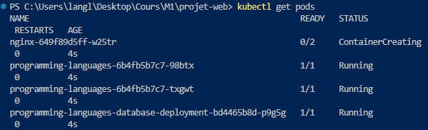
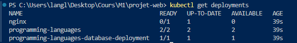
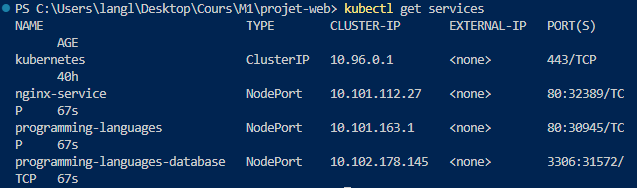
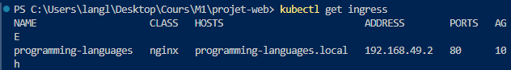

# Projet-web

Ce projet a été réalisé par LANGLOIS Emilien et TAFFOUREAU Théophile. Ce projet a pour but d'apprendre l'utilisation des technologies liées au métier de DevOps et DevSecOps à travers Docker, Kubernetes, Minikube, service mesh et bien d'autres.

Voici les points réalisé dans ce projet :

* Création des Dockerfile.
* Création des fichiers utiles à un déploiement Kubernetes.
* Un service mesh.
* Création de deux services sur des containers différents (PHP,SQL).
* Les 2 Googles LABS réalisé en cours.

## Gestion de L'application PHP

Lors de la récupération du projet Github lancer d'abord le dockerfile de la base de donnée et y récuperer l'adresse ip. Ensuite rendez-vous dans le fichier index.php afin de modifier le fichier et y changer l'adresse IP hôte de la Base de donnée SQL. Le lien se fera automatiquement.

## Gestion de DOCKER

Tout d'abord aller dans /projet-web/mysql et lancer les commandes suivantes pour lancer la base de donnée :
```bash 
docker build -t programming-languages-database .
``` 
ou depuis docker hub

```bash
docker pull emilienlgs/programming-languages-database:v1
```
puis

```bash
docker run -d --name programming-languages-database -p 3306:3306 emilienlgs/programming-languages-database:latest
```

[DockerHub Database](https://hub.docker.com/repository/docker/emilienlgs/programming-languages-database/general)

Lancement de Apache et PHP dans le dossier projet-web:

```bash
docker build -t programming-languages .
```
ou depuis docker hub
```bash
docker pull emilienlgs/programming-languages:v1
```
puis

```bash
docker run -d --name programming-languages -p 8080:80 emilienlgs/programming-languages:latest
```

[DockerHub App](https://hub.docker.com/repository/docker/emilienlgs/programming-languages/general)

Si le build des dockerfile vient du projet l'ip défini dans le fichier index.php devrait suffir sinon si le build provient de docker, il est possible que vous devriez vous rendre dans le fichier index.php de l'app pour définir l'adresse ip de la base de donnée.

voici à quoi ressemble le projet:


## Gestion de Kubernetes

### Les bases

Dans cette partie nous présenterons les bases, que ce soit pour les commandes, la configuration ou l'exploitation des pods.

Téléchargement de minikube pour gérer et manager les pods. Minikube permet de crée un dashboard qui informera l'état des pods.

```bash
minkube start
```

Cette commande vous ménera à un dashboard pour pouvoir gérer vos pods redemrarrer voir le status du pod etc :

```bash
minikube dashboard
```


[Minikube installation](https://minikube.sigs.k8s.io/docs/start/)

Obtenir l'adresse IP du pod :

```bash
kubectl describe pods
```

Pour accéder au terminal du pod nous utilisons la commande où podname correspond au nom du pod obtenu avec la commande précédente ou ```kubectl get pods```:

```bash
kubectl exec -it podname -- /bin/bash
```

## Utilisation des pods

D'abord, créer les pods depuis une image Docker Hub ou depuis une image local exemple avec mes containers, dans mon cas depuis dockerhub :

```bash
kubectl create deployment programming-languages --image=emilienlgs/programming-languages:v1
kubectl create deployment programming-languages-database --image=emilienlgs/programming-languages-database:v1
```


Pour exposer les ports en ligne pour utiliser par exemple, ma webapp :

```bash
kubectl expose deployment programming-languages --type=NodePort --port=8080
```

Puis pour obtenir le lien du pod :

```
minikube service programming-languages --url
```

Voici le rendu de la commande :


Il est aussi possible de gérer la scalabilité d'une app pour s'assurer qu'il existe toujours une app backup. Pour cela il suffit d'utiliser cette commande :

```bash
kubectl scale --replicas=2 deployment/programming-languages
```

On peut voir que 2 services programming-laguages tournent en ce moment.


## Utilisation des fichiers .yml

Afin de faciliter la création des pods et leurs déployements, vous appliquez la commande ```kubectl apply -f ./kube/``` ou alors spécifier pour l'ensemble des fichiers ```kubectl apply -f <nom_du_fichier.yml>```.

Après avoir entré cette commande, vérifier que: les services,deployements,ingress soient crées.
Les pods :

Les deployements :

Les services :

L'ingress


Maintenant modifions le fichier /etc/hosts (Linux) ou C:\windows\system32\drivers\etc\hosts (Windows) en ajoutant l'adresse ip de l'ingress et l'hôte dans mon cas ```192.168.49.2 programming-languages.local```.

Si tous va bien dans votre navigateur en tapant dans la barre de recherhce programming-languages.local, vous aurez accès à mon app. Il faudra ensuite accéder à mon application depuis la commande ```kubectl exec -it -- bash``` et modifier le fichier index.php en mettant l'ip pour se connecter à la base de donnée.
